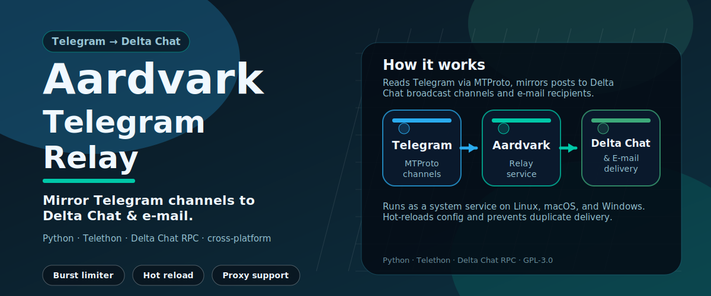

# Aardvark
`telegram-email-deltachat-relay`



Aardvark is a Telegram relay service

- **Delta Chat** broadcast channels (encrypted, app-based)
- **Plain email** recipients via SMTP
- or both at the same time

It runs as a background service on Linux, macOS, and Windows.

> **Easy start on Windows:** [English](easy-start-windows-en.md) | [Русский](easy-start-windows-ru.md) | [Español](easy-start-windows-es.md) | [Deutsch](easy-start-windows-de.md) | [中文](easy-start-windows-zh.md)

---

## What Aardvark does

Aardvark logs in to Telegram with your personal account credentials (MTProto) and watches the channels you list in `config.toml`.  For each new post it:

- Creates a matching Delta Chat broadcast channel (if Delta Chat is enabled)
- Sends the post to all configured email recipients (if email relay is enabled)
- Syncs Telegram channel thumbnails to Delta Chat automatically
- Forwards photos, videos, audio, documents, and voice messages up to a configurable size limit
- Groups multi-photo album posts: caption and first photo in the first message, remaining photos following immediately after
- Combines rapid text-message floods into a single relay message (burst limiter)
- Remembers which messages it already relayed, so restarts never produce duplicates
- Sends a "relay stopped" notice to Delta Chat channels when you remove them from the config
- Reloads `config.toml` automatically while running — no restart needed for channel or burst changes
- Automatically reconnects to Telegram if a channel goes silent for 6 hours, recovering from a known Telegram update-state drift without any service restart

---

## Requirements

- Python 3.11 or newer on the target machine
- A Telegram account
- Telegram API credentials from <https://my.telegram.org/apps>
- For Delta Chat delivery: a dedicated sender email account (IMAP/SMTP)
- For plain email delivery: access to an SMTP server

The installers include all Python dependencies in `vendor/wheels/` so no internet access is needed during installation.

`requirements.txt` lists the pinned dependency versions.  Keep it to rebuild the vendor wheel bundle or for manual installation.

### Tested on

| Platform | Version | Architecture |
| Linux | Ubuntu 24.04 LTS | x86_64 |
| macOS | macOS 15 Sequoia | Apple Silicon (arm64) |
| Windows | Windows 10 / 11 | x64 |

---

## Getting started — simplified installation guide

This is the fastest way to go from zero to a running relay.
No prior experience with Python or the command line is needed.

### Step 1 — Download the files

You need a copy of this entire repository on the machine where you want
to run the relay.  There are two ways to do it:

**Option A — with Git (recommended)**

If Git is installed, open a terminal and run:

```bash
git clone https://github.com/artur-bortsov/telegram-email-deltachat-relay.git
cd telegram-email-deltachat-relay
```

**Option B — download a ZIP file**

1. On the GitHub repository page, click the green **Code** button
2. Choose **Download ZIP**
3. Unzip the downloaded file — you will get a folder like `telegram-email-deltachat-relay-main`
4. Move or copy that folder to wherever you want to work from
   (e.g. your home directory or `C:\Projects\` on Windows)

> You must download **all the files together**, not just individual files.
> The installer, the application code, and the bundled Python packages are
> all needed and must stay in their relative directories.

### Step 2 — Open a terminal in the project folder

- **Linux / macOS:** open a terminal and `cd` into the folder:
  ```bash
  cd /path/to/telegram-email-deltachat-relay
  ```
- **Windows:** open File Explorer, navigate into the `telegram-email-deltachat-relay` folder,
  right-click on an empty area, and choose **Open in Terminal**
  (or **Open PowerShell window here** / **Open Command Prompt here**).

### Before you run the installer — what to prepare

Have the following information ready.  The setup wizard will ask for it interactively.

**Telegram**
- API ID and API hash from <https://my.telegram.org/apps>
- Your Telegram phone number (international format, e.g. `+12025551234`)

**Email account for Delta Chat / email relay** *(skip if not using)*
- A **dedicated** sender email address (do not use your personal inbox)
- The email **password** or an **App Password** — required by providers when 2FA is enabled:
  - Gmail: create at Google Account → Security → App passwords
  - Yandex: enable IMAP in mail settings, then create App Password if 2FA is on
  - Outlook: App Password required when 2FA is enabled
  - Fastmail, Mailbox.org: regular password works
- **IMAP server** hostname (e.g. `imap.gmail.com`) — used for Delta Chat
- **SMTP server** hostname (e.g. `smtp.gmail.com`) — used for email relay

Common server hostnames:

| Provider | IMAP | SMTP |
| Gmail | `imap.gmail.com` | `smtp.gmail.com` |
| Yandex | `imap.yandex.ru` | `smtp.yandex.ru` |
| Fastmail | `imap.fastmail.com` | `smtp.fastmail.com` |
| Mailbox.org | `imap.mailbox.org` | `smtp.mailbox.org` |
| Outlook/Hotmail | `outlook.office365.com` | `outlook.office365.com` |

**Telegram channels to mirror**
- The channel name(s) in `@username` or `t.me/link` format

---

### Step 3 — Run the installer for your platform

**Linux:**
```bash
sudo bash installers/linux/install.sh
```

**macOS:**
```bash
bash installers/macos/install.sh
```

**Windows:**  
Double-click `installers\windows\install.cmd` inside the project folder,
or run it from the Command Prompt:
```cmd
installers\windows\install.cmd
```

The installer will:
- check that Python 3.11+ is present (and offer to install it if not)
- install all application dependencies from the bundled packages
- run an interactive setup wizard if no configuration file is found yet
- register the service
- guide you through Telegram authentication (see Step 4)
- start the service after authentication completes

### Step 4 — Authenticate with Telegram (first time only)

> **Important:** The service cannot relay messages until you complete
> a one-time interactive login.  This login happens **in the installer's
> terminal window**, not inside the service.  Do not try to start the
> service before this step — it will silently fail to connect.

After the wizard finishes, the installer will ask:

```
Authenticate with Telegram now (recommended)? [y/N]:
```

Answer **y**.  What happens next:

1. Telegram sends an **SMS code** to your phone number.
2. You type the code in the terminal window where the installer is running.
3. If your account has **two-step verification (Cloud Password / 2FA)** enabled,
   a second prompt appears immediately after — type your Cloud Password there.
4. The session is saved to a `.session` file in the install directory.
5. The service starts automatically using the saved session.

After this you never need to log in again unless the session file is deleted.

### Step 5 — Verify the service is working

The installer waits up to 45 seconds and then shows a connection status report:

```
======================================================
  Connection status
======================================================
[INFO]  Telegram :  CONNECTED
[INFO]  Delta Chat:  CONNECTED
```

If you see `CONNECTION FAILED` or `PROXY UNREACHABLE`, check the guidance
printed below the status line and review `config.toml`.

That is all for a fresh installation.

---

## Package layout

```
app/              Service source code
tools/            config_wizard.py, validate_config.py
installers/
  linux/          install.sh, uninstall.sh
  macos/          install.sh, uninstall.sh
  windows/        install.ps1, uninstall.ps1, install.cmd, uninstall.cmd
                  winsw/WinSW-x64.exe  (Windows service wrapper)
vendor/wheels/    Offline Python dependency bundles
assets/           Project artwork
config_example.toml  Reference configuration with full documentation
requirements.txt  Pinned dependency versions
README.md         This file
```

---

## Quick install

### Linux

```bash
sudo bash installers/linux/install.sh
```

### macOS

```bash
bash installers/macos/install.sh
```

### Windows

Double-click `installers\windows\install.cmd`
— or run from an Administrator Command Prompt:

```cmd
installers\windows\install.cmd
```

The CMD file checks for PowerShell, verifies elevation, and then runs `install.ps1` automatically.  You do not need to open PowerShell yourself.

---

## What the installers do

Each installer:

1. Checks all prerequisites (Python 3.11+, required tools)
2. If a prerequisite is missing, asks permission to install it automatically, or gives exact manual installation instructions
   - On Linux, `python3-venv` is auto-installed if the `venv` module is not available (common on fresh Ubuntu installs)
3. **Stops the running service** (if one exists) before touching any files
4. Copies updated application files, preserving user data (see below)
5. Creates a Python virtual environment and installs dependencies
6. Checks whether `config.toml` exists and is complete
7. If the config is missing or incomplete, starts the interactive setup wizard
8. Creates a dedicated `logs/` directory
9. Checks firewall status and prints guidance if needed
10. Registers the service; asks for Telegram authentication if no session exists
11. Starts the service after successful authentication
12. Waits up to 45 seconds and reports the connection status of each component

The installers are **idempotent**: running them again is safe and will update files, recreate the venv if needed, and restart the service.

**What the installer preserves across updates:**
- `config.toml` — your configuration is never overwritten
- `*.session` — your Telegram session (no re-authentication needed)
- `logs/` — log files are kept
- `deltachat_accounts/` — DC account configuration, key material, and message database are never deleted; DC channels and subscriptions survive every reinstall
- `relay_state.json` — message watermarks (prevents duplicate relays after restart)
- `invite_links.txt` — existing invite links are kept

### If you already have a config.toml

If you are re-running the installer with an existing `config.toml`, the wizard
is skipped.  However, **you still need to authenticate with Telegram** if no
`.session` file is present in the install directory.  The installer detects
this and offers to run the login step for you.

If the `.session` file exists (e.g. you are updating an existing install),
the installer starts the service immediately without any prompts.

---

## Setup wizard

The wizard runs automatically during install if `config.toml` is missing or incomplete.
You can also run it manually at any time:

```bash
.venv/bin/python tools/config_wizard.py --output config.toml
```

The wizard walks you through **7 steps**:

1. **Telegram credentials** — API ID, API hash, phone number
2. **Channels** — which Telegram channels to mirror
3. **Relay mode** — Delta Chat only / email only / both
4. **Delta Chat account** (if DC is enabled)
5. **Plain email relay** (if email is enabled)
6. **Proxy** (optional)
7. **Relay and burst settings**

At the end the wizard shows your config file path, log location, invite link file path, and service control commands.

### Telegram API credentials

Get them at <https://my.telegram.org/apps>:

1. Sign in with your Telegram phone number
2. Create a new application (any name, e.g. "Aardvark")
3. Copy `api_id` (a number) and `api_hash` (a 32-character hex string)

### First login and two-step verification

> **The service will not connect to Telegram until this step is completed.**
> Skipping it causes the service to start but silently fail to relay anything.

Before the service can run as a background process, you must authenticate
interactively **once** from a terminal.  Run this command in the install
directory:

```bash
# Linux / macOS
.venv/bin/python app/relay.py --login --config config.toml

# Windows (run as Administrator in a Command Prompt or PowerShell window)
.venv\Scripts\python app\relay.py --login --config config.toml
```

What happens:

1. Telegram sends an **SMS verification code** to the phone number in `config.toml`.
2. You type the code in the **terminal window** where you ran `--login`.
   The code is entered here — not inside the service, which has no terminal.
3. If your account has a **Cloud Password (2FA)** enabled, a second prompt
   appears immediately after the SMS code.  Type your password there.
4. A `.session` file is saved in the current directory.
5. You can now start the service.  It loads the session silently on every start.

After one successful `--login` you never need to run it again unless you
delete the `.session` file or revoke the session from another Telegram client.

**The installer handles this automatically** during a fresh install.  You
only need to run `--login` manually if:
- You are setting up the service without the installer
- You deleted or lost the `.session` file
- The session expired or was revoked

---

## Default install locations

| Platform | Install directory |
| Linux | `/opt/aardvark` |
| macOS | `~/Library/Application Support/Aardvark` |
| Windows | `C:\Program Files\Aardvark` |

---

## Configuration file

The main configuration is `config.toml`.  Copy `config_example.toml` to get started, or let the wizard generate it.

The config file is reloaded automatically while the service is running.  Channel additions and removals, and burst settings, take effect within about 30 seconds.  Other changes require a service restart.

### Key sections

**[telegram]** — your Telegram account credentials and session name

**[channels]** — list of channels to mirror; accepts `@username`, `t.me/username`, or numeric IDs

**[delta_chat]** — sender email account for Delta Chat  
- Set `enabled = false` to use email-only mode and skip Delta Chat entirely

**[relay]** — history replay, media size limit, album behaviour, state file

**[burst]** — text flood protection

**[proxy]** — proxy for **Telegram connections only**  
- Supports `socks5`, `http`, and `mtproto`
- MTProto is Telegram-specific; it **cannot** be used for Delta Chat or email

**[dc_proxy]** — separate proxy for **Delta Chat and email relay** (optional)  
- Supports `socks5` and `http` only (not MTProto)
- Required when Telegram uses MTProto and DC/email also need a proxy
- If absent and `[proxy]` is `socks5`/`http`, DC and email automatically
  inherit the Telegram proxy settings

Common setups:
- **Telegram MTProto + DC SOCKS5:** set both `[proxy]` and `[dc_proxy]`
- **Everything through one SOCKS5:** set only `[proxy]` with `use_for_dc = true`
- **Telegram only needs a proxy:** set `[proxy]` with `use_for_dc = false`

**[email_relay]** — plain SMTP forwarding, independent of Delta Chat

### Email address recommendations

- Use a **separate, dedicated email address** as the sender for Delta Chat.  Do not use your personal inbox.
- The email relay can use the same address as Delta Chat, or a different one.
- Suggested providers: Fastmail, Mailbox.org, Gmail (with App Password).

### SSL / TLS for email

The `ssl_mode` field controls how Aardvark connects to your SMTP server:

- `"ssl"` (default) — implicit TLS on port 465 (recommended)
- `"starttls"` — STARTTLS upgrade on port 587
- `"none"` — plain connection (only for trusted local servers)

Delta Chat always uses TLS for IMAP and SMTP.

---

## Relay modes

### Delta Chat only

```toml
[delta_chat]
enabled = true
addr    = "relay-sender@example.com"
mail_pw = "..."

[email_relay]
enabled = false
```

### Email only (no Delta Chat)

```toml
[delta_chat]
enabled = false

[email_relay]
enabled       = true
smtp_host     = "smtp.example.com"
smtp_port     = 465
smtp_user     = "relay-sender@example.com"
smtp_password = "..."
ssl_mode      = "ssl"
target_emails = ["recipient@example.com"]
```

### Both

Enable both sections.

---

## Proxy

```toml
[proxy]
enabled       = true
type          = "socks5"   # "socks5", "http", or "mtproto"
host          = "127.0.0.1"
port          = 1080
username      = ""
password      = ""
rdns          = true
use_for_dc    = true
use_for_email = true
```

SOCKS5 and HTTP proxies require PySocks (already in `requirements.txt`).
MTProto proxy is built into Telethon — no extra packages needed.
For MTProto, leave `username` empty and put the proxy secret in `password`.

---

## Logs

Logs are written to `logs/relay.log` inside the install directory.
Rotation: 10 MB per file, 10 files kept (100 MB total).

To follow logs in real time:

```bash
# Linux
journalctl -u aardvark-relay -f
# or
tail -f /opt/aardvark/logs/relay.log

# macOS
tail -f "$HOME/Library/Application Support/Aardvark/logs/relay.log"

# Windows
Get-Content "C:\Program Files\Aardvark\logs\relay.log" -Wait -Tail 50
```

---

## Service control

### Linux (systemd)

```bash
sudo systemctl status  aardvark-relay
sudo systemctl start   aardvark-relay
sudo systemctl stop    aardvark-relay
sudo systemctl restart aardvark-relay
```

> **Autostart on Linux: starts at system boot.**
> The service is a systemd unit registered in `multi-user.target`.
> It starts automatically at every boot, before any user logs in.

### macOS (launchd)

```bash
launchctl print gui/$(id -u)/com.aardvark.relay          # status
launchctl bootout  gui/$(id -u) ~/Library/LaunchAgents/com.aardvark.relay.plist  # stop
launchctl bootstrap gui/$(id -u) ~/Library/LaunchAgents/com.aardvark.relay.plist # start
```

> **Autostart on macOS: starts at user login, not at system boot.**
> The service is registered as a user-level LaunchAgent
> (`~/Library/LaunchAgents/com.aardvark.relay.plist`).
> It starts automatically when you log in to your macOS account,
> but not before (i.e. not at the login screen).
> For unattended 24/7 operation, enable automatic login:
> **System Settings → Users & Groups → Automatic Login**.
>
> Linux (systemd) and Windows (Windows Service) both start at system boot,
> before any user logs in.

### Windows (Service)

```cmd
sc query   AardvarkRelay
sc start   AardvarkRelay
sc stop    AardvarkRelay
```

> **Autostart on Windows: starts at system boot.**
> The service is registered as a Windows Service set to start automatically.
> It starts at boot, before any user logs in.

---

## Delta Chat invite links

After the service starts for the first time, invite links for each Delta Chat broadcast channel are written to `invite_links.txt` (or the path set in `relay.invite_links_file`).

**Share these links only through a secure channel** (e.g. Signal, encrypted email).  Anyone who receives a link can join the broadcast channel and receive forwarded messages.

Recipients must install the Delta Chat app and accept the invite.  Once joined they receive all future relayed messages.

---

## Media relay

Aardvark forwards photos, videos, documents, audio, and voice messages.

If a file exceeds `max_media_size_mb`, Aardvark skips the download and sends a placeholder text instead:

```
[Video – 45.2 MB, not relayed (limit: 10 MB)]
```

Set `max_media_size_mb = 0` to relay all media regardless of size.

Multi-photo album posts (several files sent as one Telegram post) are handled as a group:
the first message contains the caption and first media file; remaining files follow immediately after.

---

## Burst limiter

Channels that post many text messages in rapid succession are automatically combined into a single relay message.  The default threshold is 20 messages within 5 minutes.  Media messages bypass the limiter.

---

## Hot reload

Edit `config.toml` while the service is running.  Channel additions and removals and burst-limiter settings apply automatically within ~30 seconds.  Other changes (credentials, proxy, email settings) require a service restart.

When you remove a channel from the config, Aardvark sends a "relay stopped" message to the corresponding Delta Chat channel.

---

## Running without the installers (manual setup)

```bash
python3 -m venv .venv
.venv/bin/pip install --no-index \
  --find-links vendor/wheels/common \
  --find-links vendor/wheels/linux-x86_64 \   # or macos-arm64 / windows-amd64
  -r requirements.txt
.venv/bin/python tools/config_wizard.py --output config.toml
.venv/bin/python app/relay.py --config config.toml --log-level INFO
```

On Windows, replace `.venv/bin/` with `.venv\Scripts\`.

---

## Security notes

- Never publish `config.toml` — it contains credentials
- Never publish `.session` files — they contain Telegram session tokens
- Never publish the Delta Chat database file
- Use dedicated email accounts for the relay sender (not personal inboxes)
- Keep the install directory readable only by the service user
- Distribute Delta Chat invite links only over secure channels

---

## Running the installer: source folder vs. install directory

Where you run the installer from determines what it does.

### From the source / download folder *(normal use — updates the service)*

This is the standard way to install or update Aardvark:

```bash
# Linux — run from the downloaded project folder
sudo bash installers/linux/install.sh

# macOS — run from the downloaded project folder
bash installers/macos/install.sh

# Windows — double-click or run from the downloaded project folder
installers\windows\install.cmd
```

The installer copies updated application files from the download folder into the
install directory (`/opt/aardvark`, `~/Library/Application Support/Aardvark`,
or `C:\Program Files\Aardvark`), recreates the virtual environment, and restarts
the service.  User data (`config.toml`, session, logs, DC accounts) is preserved.

### From inside the install directory *(maintenance / health check)*

If you run the installer from **inside the install directory** itself, no files
are updated (the source and destination are the same folder).

**Windows** detects this automatically and switches to **maintenance mode**, which:
- Checks Python venv integrity
- Validates `config.toml` completeness (offers the wizard if broken)
- Detects expired or corrupted Telegram sessions and offers to re-authenticate
- Starts or restarts the service if it is not running
- Reports connection status (Telegram, Delta Chat, email relay)
- Displays Delta Chat invite links (waits up to 45 s)

**Linux and macOS** do not have a dedicated maintenance mode.  If you run the
installer from within the install directory on those platforms, it is effectively
a no-op (rsync source = destination).  Use standard service control commands for
health checks instead:

```bash
# Linux
sudo systemctl status aardvark-relay

# macOS
launchctl print gui/$(id -u)/com.aardvark.relay
```

> **Rule of thumb:** always run the installer from the **source/download folder**
> when you want to update.  Run it from the install directory only on Windows
> as a maintenance/health-check shortcut.

---

## Troubleshooting

**No Delta Chat messages arriving**
The target channel has no subscribers yet.  Open `invite_links.txt`, join the channel using the invite link in Delta Chat, and wait for the securejoin process to complete.

**Duplicate messages after restart**
Check that `relay_state.json` exists and is writable by the service user.

**Email relay not working**
Verify `smtp_host`, `smtp_port`, `ssl_mode`, `smtp_user`, and `smtp_password`.  Check that your email provider allows SMTP access and that you are using an App Password if your account has 2FA enabled.

**Telegram login asks for SMS code again**
The `.session` file is missing or unreadable.  Make sure the install directory is writable and the session file is preserved across updates.

**Proxy not working**
For SOCKS5/HTTP, verify PySocks is installed (`pip show PySocks`).  For MTProto, verify the proxy secret is correct.

**Album messages arriving out of order**
This is usually a network timing issue.  Increase `album_window_seconds` in `config.toml` (e.g. to `10.0`) to give all album parts more time to arrive before the group is dispatched.  Run with `--log-level DEBUG` and check `logs/relay.log` for album group assembly details.

**Channel thumbnail (icon) not appearing**
The thumbnail download requires Telethon to open a secondary connection to a different Telegram Data Center.  With an MTProto proxy this secondary connection often fails.  The relay retries on every startup.  Disabling the proxy (setting `proxy.enabled = false`) usually fixes this immediately.  If a proxy is required, try a different MTProto proxy server that supports media DC connections.

**Messages stop arriving from a channel for several hours**
Telegram's server can stop pushing updates for a specific channel to long-running clients (a known Telethon issue with update-state drift).  Aardvark detects this automatically: if all watched channels are silent for 6 hours, the service reconnects to Telegram, replays recent history, and resumes delivery — without any manual intervention.  You will see a `Watchdog: reconnect complete` entry in `relay.log` when this happens.

If you notice the problem before the watchdog fires, restarting the service manually is sufficient:
```bash
# Linux
sudo systemctl restart aardvark-relay
# macOS
launchctl kickstart -k "gui/$(id -u)/com.aardvark.relay"
# Windows
sc stop AardvarkRelay && sc start AardvarkRelay
```

**DC broadcast channels recreated / subscribers lost old channel**
This can happen if the `deltachat_accounts/` directory was deleted during a reinstall (a bug present in early versions, now fixed).  Each recreation generates a new invite link.  Subscribers on the old channel must rejoin using the new link from `invite_links.txt`.  The current links are always in that file.

---

Project codename: **Aardvark**

---

## License

This project is licensed under the **GNU General Public License v3.0**.
See the [LICENSE](LICENSE) file for details.
